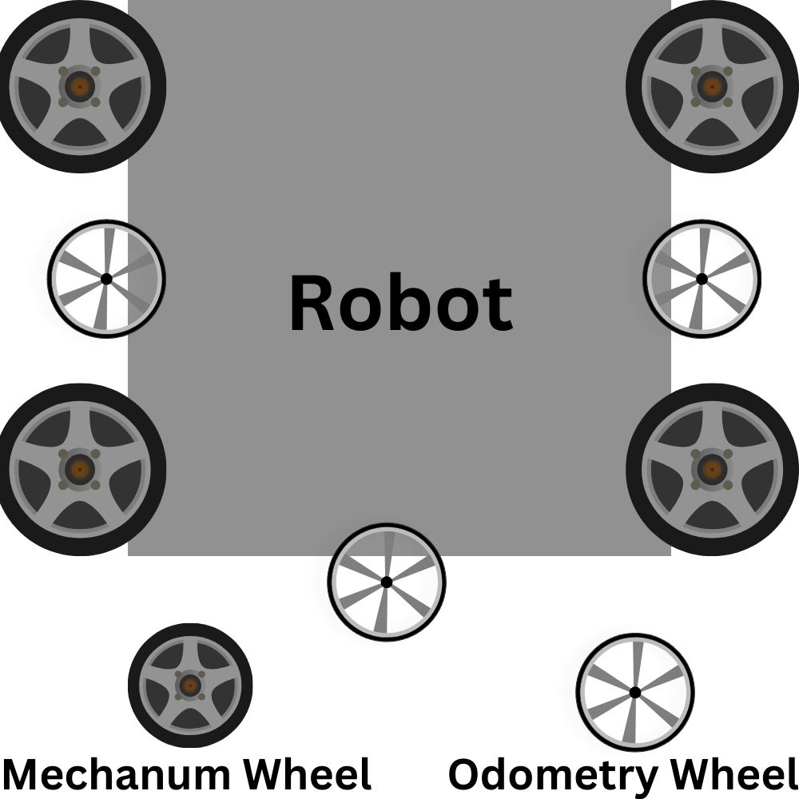

# C.O.Y.O.T.E.

Control Of Your Own Trajectory Estimation

- Works for robots with 3 Odometry wheels and 4 mechanum wheels.
- Live position/angle tracking along with velocities for each.
- Function for driving to a specific point.
- Asynchronous function for driving to a specific point.
- Built in robot deceleration and acceleration.
- Live Path Correction.
<h3 class="center">Image of basic robot construction</h3>
  

# Installation

# Notes

- IMU setup is not included, it is assumed your IMU is already setup, this is necessary for use of COYOTE.
- It is optimal to run all setup functions with a battery that is not close to being dead.

## Basic

1. Open the repository in the IDE of your choice , i.e., Android Studio, IntelliJ....

2. Go to the initiliaze function inside of the Coyote class, Change each of the strings in the lines that say
   `"hardwareMap.get(DcMotorEx.class, "");"` to the name of that part in your robots hardware map.

3. Install the code onto the robot

4. Run the FindMotorDirections function and if any motors are not going forward add a line to reverse the motor under the line `backRight.setZeroPowerBehavior(DcMotor.ZeroPowerBehavior.BRAKE);` for example `frontRight.setDirection(DcMotorSimple.Direction.REVERSE);` would reverse the frontright motor. Then install the updated code.

5. Run TestAngular opmode and if the ratio value is negative, add this line to reverse the encoder in the same spot where you added your last reversing line `deadPerp.setDirection(DcMotorSimple.Direction.REVERSE);`, Then install the updated code.
6. Next Run the FindInPerTick opMode and push the robot forward if the ticksLeft value is negative add this line in initiliaze: `deadLeft.setDirection(DcMotorSimple.Direction.REVERSE);` and if the ticksRight is negative add this line `deadRight.setDirection(DcMotorSimple.Direction.REVERSE);`, Then install the updated code.
7. Run FindInPerTick opMode again and push the robot forward in a straight line for at least 2 feet. Then divide the distance in inches you pushed it and divide that by the average of ticksRight and ticksLeft. At the top of the Coyote.java class find the line ` public double inPerTick = 0;` and replace the 0 with your inches per tick. Then install the updated code.
8. Run the TestAngular opMode until the ratio value it displays has settled and is not changing by more than a tenth. Record this value then at the top of the Coyote.java class find the line, `double ratio = 0;` and replace the 0 with your ratio., install the updated code.
9. Run the FindMinimumPower opMode the robot should ramp up the motors until it moves. The robot will then stop and give you a value called minimumPower. Go back to Coyote.java and find the line `double minimumPower = 0;` replace the 0 with your minimum power. Install the updated code.
10. Run the FindMaxVelocity opMode and the robot should go forward and continue to drive while recording its maximum velocity.Run this until the robot is at a constant speed, record the value printed called Max Velocity and stop the robot. Find the line in Coyote.java `double maxVelocity = 0;` and replace the 0 with your maxVelocity. Install the final code.
11. Congratulations You have successfully setup COYOTE for your robot!

# Testing

Running the Test opMode will initiliaze the robot at a position of 0,0 and an angle of 0. Then it will constantly print the position of your robot in inches and the angle. You can use this to check if yout setup was a success.

Running the TestMove opMode will have the robot move forward 10 inches and to the right 10 inches, then the robot will turn 180 degrees.
